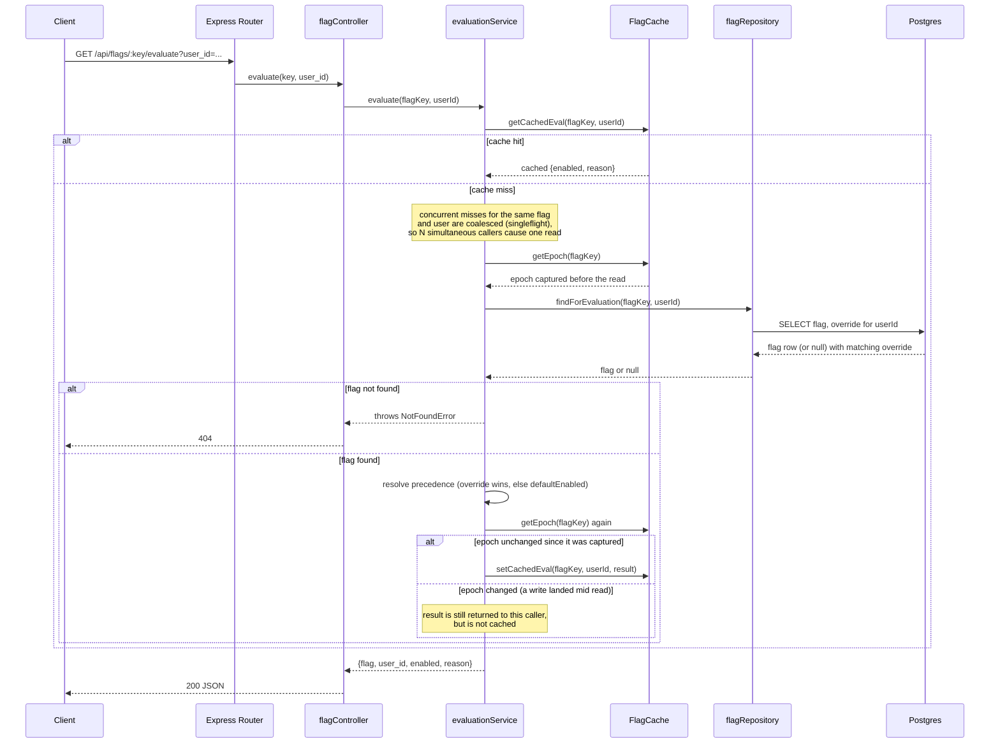
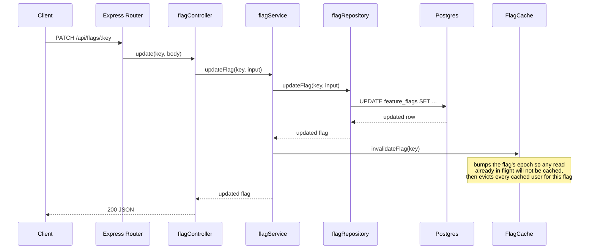

# Architecture

This describes only what is implemented in the code today.

## Layers

Routes and controllers are thin HTTP adapters: they parse and validate the request, call a service method, and translate the result to a status code and JSON body. All business logic, including cache orchestration and evaluation precedence, lives in the service layer (`flagService`, `overrideService`, `evaluationService`). Repositories are the only layer that calls Prisma. A composition root (`src/container.ts`) wires one shared cache instance and the real repositories into each service factory for the running app; tests construct their own isolated instances instead.

## Evaluation precedence

Evaluating a flag for a user checks for a per-user override first. If one exists, its value wins regardless of the flag's global default, even if the override disables a flag that is enabled by default. If no override exists, the flag's global `defaultEnabled` value is used instead. A flag that does not exist returns 404, which is distinct from a flag that exists but has no override for that user, which returns 200 with `reason: "global"`.

## Read path: evaluate

## Write path: invalidation after commit

Shown for `PATCH /api/flags/:key`. `DELETE /api/flags/:key` follows the same shape and also calls `invalidateFlag`. `PUT` and `DELETE` on `/api/flags/:key/users/:userId` call `invalidateEval` instead, which evicts only that one user's cached entry for the flag rather than every user.

